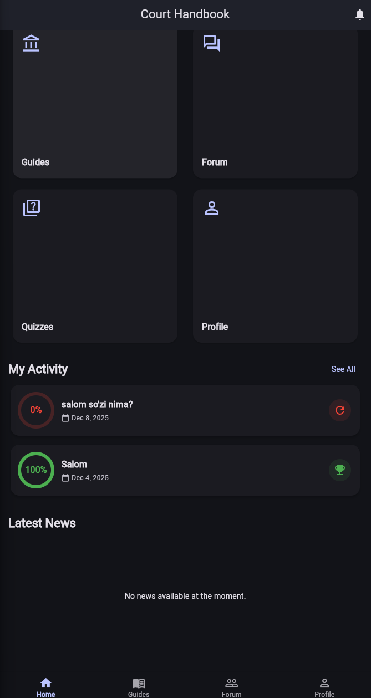
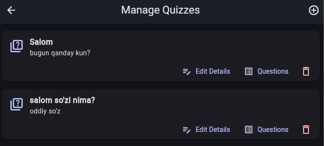
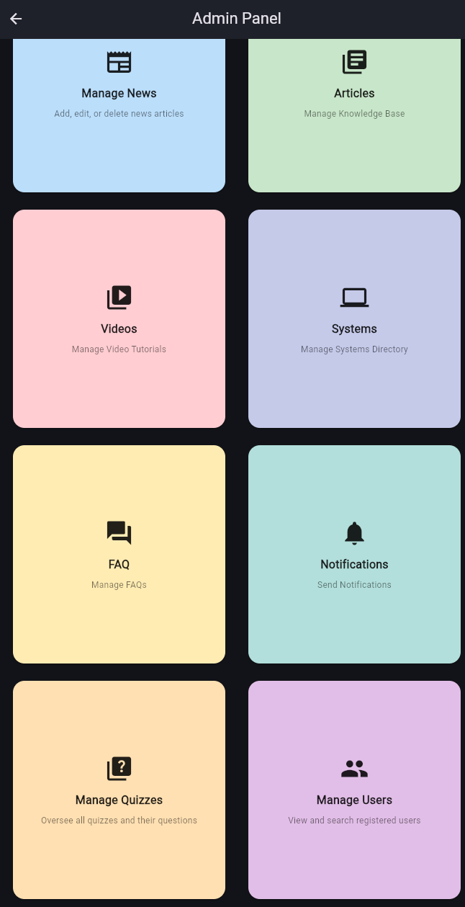
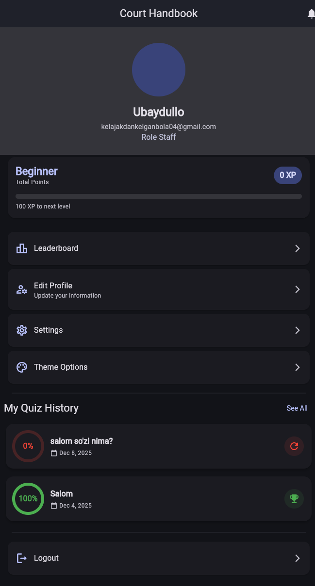
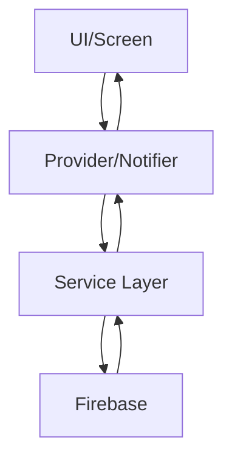

# 🎓 Sud Qo'llanma - Ta'lim Platformasi

> Flutter yordamida qurilgan zamonaviy ta'lim boshqaruv tizimi


---

## 📱 Loyiha Haqida

**Sud Qo'llanma** - bu sud xodimlari va ekspertlar uchun mo'ljallangan to'liq qamrovli ta'lim platformasi. Ilova zamonaviy texnologiyalar asosida qurilgan bo'lib, bilimlarni baham ko'rish, testlar orqali bilimni tekshirish va hamjamiyat bilan muloqot qilish imkoniyatlarini taqdim etadi.

### 🎯 Asosiy Maqsadlar

- 📚 Ta'lim resurslarini markazlashtirilgan tarzda boshqarish
- ✅ Interaktiv testlar orqali bilimni baholash
- 👥 Professional hamjamiyat yaratish
- 📊 O'qish jarayonini kuzatish va tahlil qilish
- 🎓 Gamification elementlari orqali motivatsiyani oshirish

---

## ✨ Asosiy Xususiyatlar

### 🔐 Autentifikatsiya va Foydalanuvchi Boshqaruvi

- **Multi-platform Login**
  - 📧 Email/Password autentifikatsiya
  - 🌐 Google Sign-In (Web, Android, iOS)
  - 👤 Username yoki Email orqali kirish
  
- **Rol-based Access Control**
  - 👨‍💼 Xodim (Employee) - asosiy foydalanuvchilar
  - 🎓 Ekspert - maxsus huquqlar bilan
  - 👑 Admin - to'liq boshqaruv huquqlari

- **Profil Boshqaruvi**
  - Shaxsiy ma'lumotlarni tahrirlash
  - Profil rasmini yuklash
  - Bio va qo'shimcha ma'lumotlar

### 📚 Ta'lim Resurslari

- **Resurs Yaratish va Boshqarish**
  - Turli kategoriyalardagi resurslar
  - Rich-text formatlash qo'llab-quvvatlash
  - Fayl va media yuklash
  - Resurslarni tahrirlash va o'chirish

- **Resurs Ko'rish**
  - Qulay interfeys
  - Kategoriya bo'yicha filtrlash
  - Qidiruv funksiyasi
  - Bookmark va sevimlilar

### ✅ Test Tizimi

- **Test Yaratish**
  - Multiple choice savollar
  - True/False savollar
  - To'g'ri javoblarni belgilash
  - Resurslar bilan bog'lash

- **Test Topshirish**
  - Real-time javob berish
  - Natijalarni avtomatik tekshirish
  - Ball va foiz ko'rinishida natija
  - Urinishlar tarixini saqlash

- **Admin Panel**
  - Barcha testlarni ko'rish va boshqarish
  - Savollarni tahrirlash
  - O'chirish funksiyasi

### 💬 Hamjamiyat

- **Munozaralar (Discussions)**
  - Mavzular yaratish
  - Izohlar qoldirish
  - Real-time yangilanishlar (Flutter Streams)
  - Kategoriyalash

- **Ijtimoiy Interaksiya**
  - Boshqa foydalanuvchilar bilan muloqot
  - Savol-javob
  - Tajriba almashish

### 🎮 Gamification

- **XP (Experience Points) Tizimi**
  - Test topshirish uchun XP olish
  - Resurs yaratish uchun ball
  - Faol ishtirok uchun mukofotlar

- **Darajalar (Levels)**
  - Boshlang'ich (0-100 XP)
  - O'rta (100-500 XP)
  - Yuqori (500-1000 XP)
  - Ekspert (1000+ XP)

### 👨‍💼 Admin Panel

- **Foydalanuvchilar Boshqaruvi**
  - Barcha foydalanuvchilarni ko'rish
  - Rol va ma'lumotlarni ko'rish
  - Registratsiya tarixini kuzatish

- **Kontent Moderatsiyasi**
  - Yangiliklar boshqaruvi
  - Resurslarni tasdiqlash
  - Testlarni nazorat qilish

- **Dashboard**
  - Statistika va hisobotlar
  - Faol foydalanuvchilar
  - Popular resurslar

### 🔔 Xabarnomalar (Notifications)

- **Turlari**
  - Tizim yangiliklari
  - Yangi kontent (Maqola, Video)
  - Eslatmalar
  - Murojaat holati o'zgarishi

- **Funksiyalar**
  - O'qilmaganlar soni (Badge)
  - "Mark all as read" imkoniyati
  - To'g'ridan-to'g'ri kontentga o'tish

### 📊 Statistika va Tarix

- **Viktorina Tarixi**
  - To'liq tarix (Vaqt bo'yicha guruhlangan)
  - So'nggi natijalar (Profil preview)
  - Batafsil natijalar ko'rish

### 🌍 Lokalizatsiya

- **Multi-language Support**
  - 🇺🇿 O'zbek tili (Lotin)
  - 🇷🇺 Rus tili
  - 🇬🇧 Ingliz tili
  - Dinamik til almashish

- **Tema Qo'llab-quvvatlash**
  - ☀️ Yorug'lik rejimi
  - 🌙 Qorong'u rejim
  - 🔄 Tizim bo'yicha avtomatik

---

## 🏗️ Texnologik Stack

### Frontend

```yaml
Framework: Flutter 3.x
Language: Dart
State Management: Provider
```

### Backend & Services

```yaml
Authentication: Firebase Auth
Database: Cloud Firestore
Storage: Firebase Storage (rejada)
Hosting: Firebase Hosting (web)
```

### Key Packages

| Package | Versiya | Maqsad |
|---------|---------|--------|
| `firebase_core` | ^3.10.0 | Firebase asosiy funksiyalar |
| `firebase_auth` | ^5.3.5 | Autentifikatsiya |
| `cloud_firestore` | ^5.5.2 | NoSQL database |
| `google_sign_in` | ^6.2.2 | Google login |
| `provider` | ^6.1.2 | State management |
| `intl` | ^0.19.0 | Lokalizatsiya |

---

## 🗂️ Loyiha Strukturasi

```
lib/
├── main.dart                          # Entry point
├── models/                            # Data models
│   ├── users.dart                    # User & UserRole
│   ├── auth_notifier.dart            # Auth state management
│   ├── quiz.dart                     # Quiz model
│   ├── question.dart                 # Question model
│   └── quiz_attempt.dart             # Test attempts
│
├── services/                          # Business logic
│   ├── auth_service.dart             # Authentication
│   ├── profile_service.dart          # User profiles
│   ├── quiz_service.dart             # Quiz operations
│   └── resource_service.dart         # Resources
│
├── screens/                           # UI Screens
│   ├── auth/                         # Login, Register
│   ├── home/                         # Dashboard, HomePage
│   ├── profile/                      # Profile, Settings
│   ├── resource/                     # Resources, Quiz
│   ├── community/                    # Discussions
│   └── admin/                        # Admin panel
│
├── widgets/                           # Reusable widgets
│   ├── auth_wrapper.dart             # Auth routing
│   └── custom_*.dart                 # Custom components
│
└── l10n/                             # Localization files
    ├── app_en.arb                    # English
    ├── app_uz.arb                    # Uzbek
    └── app_ru.arb                    # Russian
```

---

## 🚀 O'rnatish va Ishga Tushirish

### Talablar

- Flutter SDK (3.0+)
- Dart SDK
- Firebase loyihasi
- IDE (VS Code yoki Android Studio)

### Qadamlar

1️⃣ **Repository'ni Klonlash**
```bash
git clone https://github.com/username/education_app.git
cd education_app
```

2️⃣ **Dependencies O'rnatish**
```bash
flutter pub get
```

3️⃣ **Firebase Sozlash**
- Firebase Console'da yangi loyiha yarating
- FlutterFire CLI orqali configure qiling:
```bash
firebase login
flutterfire configure
```

4️⃣ **Lokalizatsiya Generatsiya**
```bash
flutter gen-l10n
```

5️⃣ **Ilovani Ishga Tushirish**

**Web:**
```bash
flutter run -d chrome
```

**Android:**
```bash
flutter run -d android
```

**iOS:**
```bash
flutter run -d ios
```

---

## 📸 Screenshots

<!-- Screenshots qo'shiladi -->

### Home Screen


### Test Topshirish


### Admin Dashboard


### Profile Screen


---

## 🎨 Dizayn va UX

### Dizayn Printsiplari

- **Material Design 3** - zamonaviy va intuitiv interfeys
- **Responsive Layout** - barcha ekran o'lchamlariga moslashuv
- **Accessibility** - maxsus ehtiyojlar uchun qo'llab-quvvatlash
- **Dark Mode** - ko'zni asraydigan qorong'u tema

### Color Palette

```dart
Primary: Blue (#2196F3)
Secondary: Orange (#FF9800)
Success: Green (#4CAF50)
Error: Red (#F44336)
```

---

## 🔮 Kelajak Rejalar

### Qisqa Muddatli (1-3 oy)

- [ ] 🔔 Push Notifications
  - Yangi resurs e'lonlari
  - Test natijalari xabarnomasi
  - Munozara javoblari
  
- [ ] 📊 Advanced Analytics
  - Foydalanuvchi faolligi statistikasi
  - Test natijalari tahlili
  - O'rganish tendentsiyalari

- [ ] 🎯 Progress Tracking
  - Shaxsiy rivojlanish grafigi
  - Tugallangan kurslar
  - Sertifikatlar

- [ ] 📱 Offline Mode
  - Keshlaangan kontent
  - Offline test topshirish
  - Sync yangilanishlar

### O'rta Muddatli (3-6 oy)

- [x] 🎥 Video Content
  - Video darslar qo'llab-quvvatlash
  - YouTube integratsiya
  - Video progress tracking

- [ ] 📝 Rich Content Editor
  - Markdown qo'llab-quvvatlash
  - Code snippet
  - LaTeX formula

- [x] 🏆 Achievements & Badges
  - Yutuq tizimi
  - Nishonlar to'plami
  - Leaderboard

- [ ] 💬 Real-time Chat
  - Direct messaging
  - Guruh chat
  - File sharing

### Uzoq Muddatli (6+ oy)

- [ ] 🤖 AI Assistant
  - Chatbot yordamchi
  - Tavsiyalar tizimi
  - Avtomatik javoblar

- [ ] 📚 Custom Learning Paths
  - Shaxsiylashtirilgan o'quv rejalar
  - Adaptive learning
  - Skill-based progression

- [ ] 🌐 Multi-tenant System
  - Boshqa tashkilotlar uchun
  - White-label yechim
  - Custom branding

- [ ] 📊 Advanced Reporting
  - Excel export
  - PDF hisobotlar
  - Grafik visualizatsiya

---

## 🏗️ Arxitektura

### State Management

```
Provider Pattern ishlatilgan:

AuthNotifier (ChangeNotifier)
    ├── AuthService
    └── ProfileService
        └── Firestore

QuizService
    └── Firestore (quizzes, questions)
```

### Data Flow



### Firebase Structure

```
firestore/
├── users/
│   └── {userId}
│       ├── name
│       ├── email
│       ├── role
│       ├── xp
│       └── level
│
├── quizzes/
│   └── {quizId}
│       ├── title
│       ├── description
│       └── questions/
│           └── {questionId}
│
├── quiz_attempts/
│   └── {attemptId}
│       ├── userId
│       ├── quizId
│       ├── score
│       └── attemptedAt
│
└── resources/
    └── {resourceId}
```

---

## 🧪 Testing

### Unit Tests
```bash
flutter test
```

### Widget Tests
```bash
flutter test test/widget_test.dart
```

### Integration Tests
```bash
flutter test integration_test/
```

---

## 🤝 Contributing

Loyihaga hissa qo'shish uchun:

1. Fork qiling
2. Feature branch yarating (`git checkout -b feature/AmazingFeature`)
3. O'zgarishlarni commit qiling (`git commit -m 'Add some AmazingFeature'`)
4. Branch'ni push qiling (`git push origin feature/AmazingFeature`)
5. Pull Request oching

---

## 📄 License

Bu loyiha MIT litsenziyasi ostida tarqatiladi. Batafsil ma'lumot uchun [LICENSE](LICENSE) faylini ko'ring.

---

## 👥 Jamoa

- **Developer**: Ubaydullo
- **Designer**: Ubaydullo
- **Project Manager**: Ubaydullo

---

## 📞 Aloqa

- 📧 Email: support@sudqollanma.uz
- 🌐 Website: https://sudqollanma.uz
- 💬 Telegram: @sudqollanma

---

## 🙏 Minnatdorchilik

Quyidagi open-source loyihalarga rahmat:

- [Flutter](https://flutter.dev)
- [Firebase](https://firebase.google.com)
- [Provider](https://pub.dev/packages/provider)
- [Material Design](https://material.io)

---

<div align="center">

**Sud Qo'llanma** bilan bilimingizni oshiring! 🚀

Made with ❤️ in Uzbekistan

</div>
