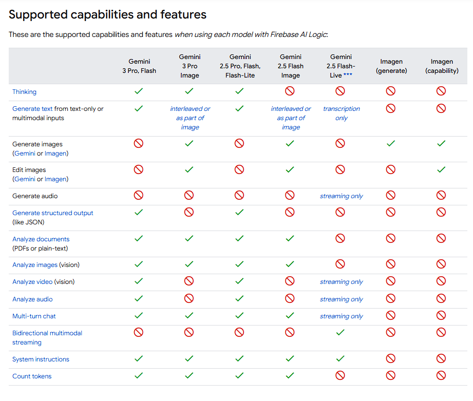
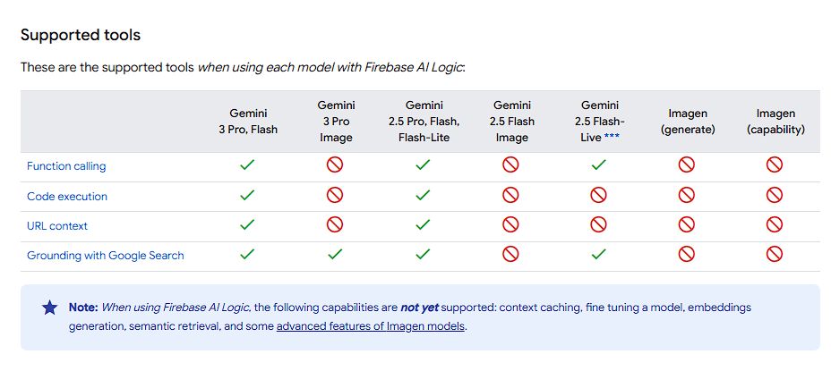
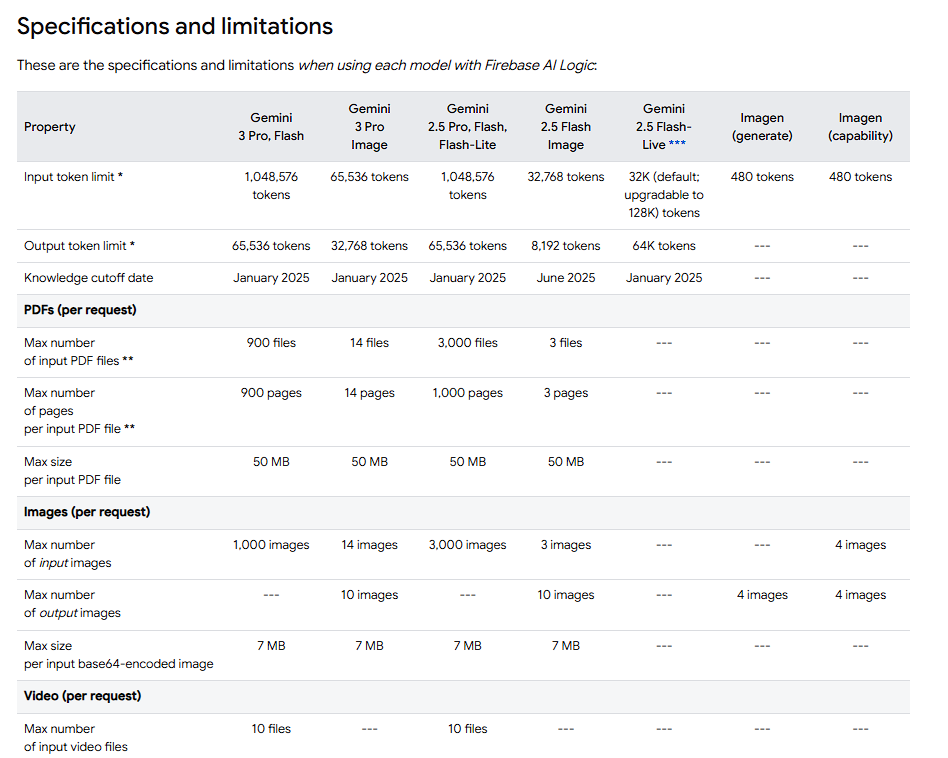
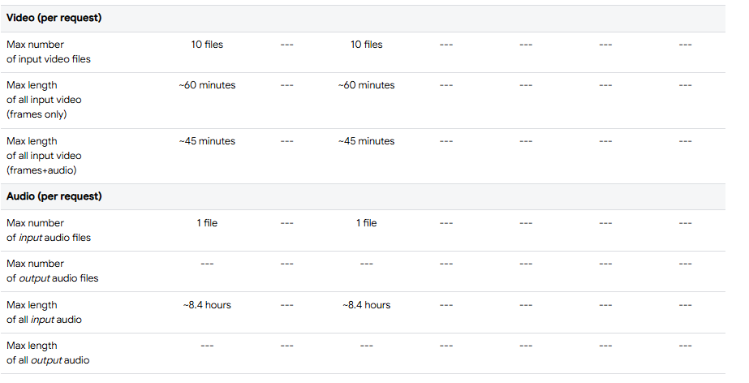
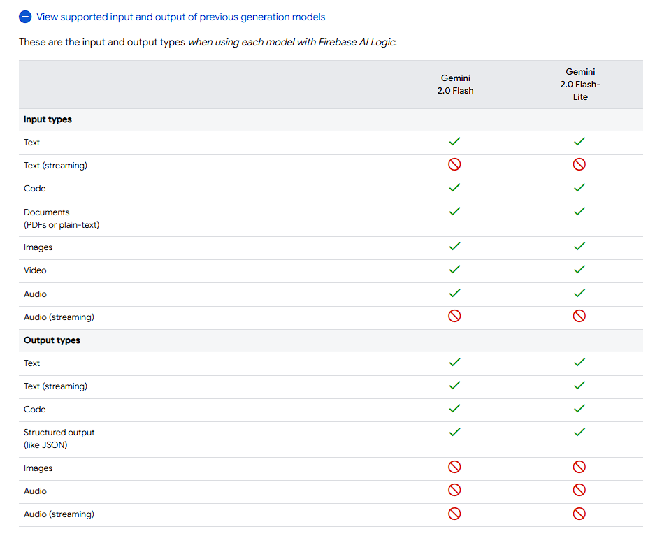
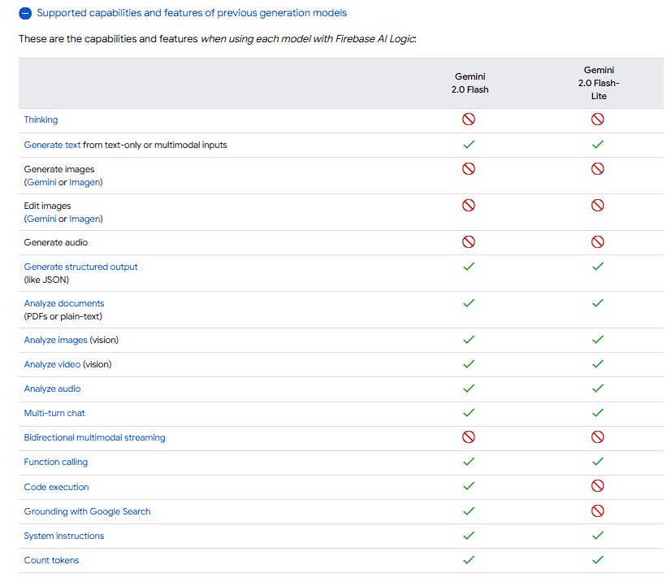
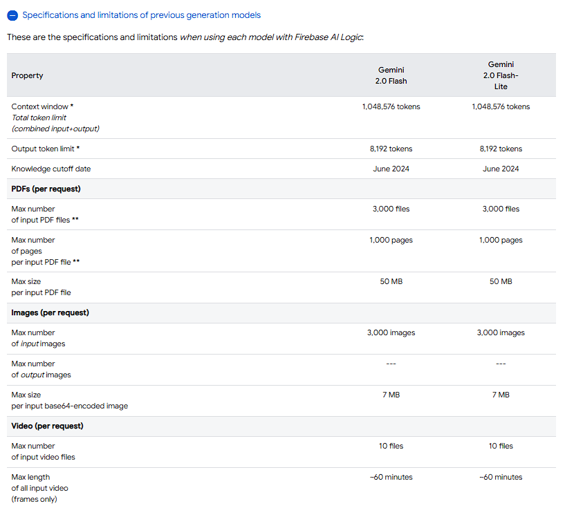
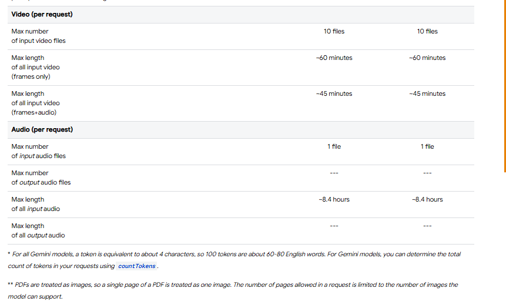
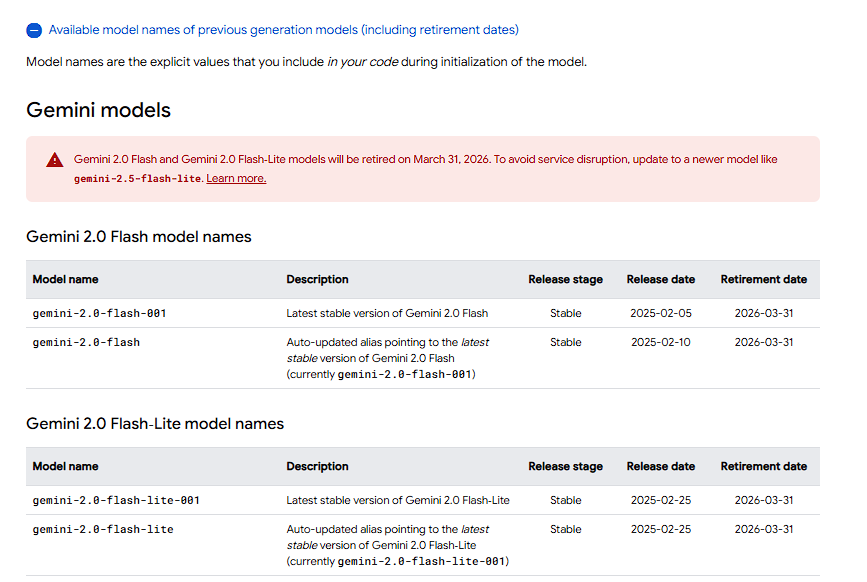
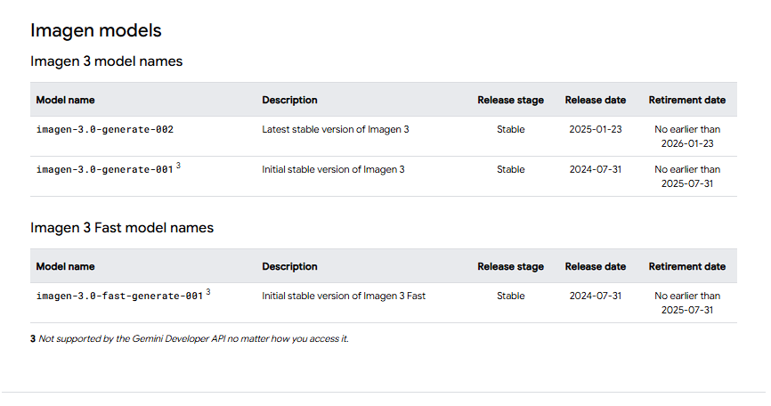

In your lib/main.dart file, import the Firebase core plugin, the Firebase AI Logic plugin, and the configuration file you generated earlier:

import 'package:firebase\_core/firebase\_core.dart';

import 'package:firebase\_ai/firebase\_ai.dart';

import 'firebase\_options.dart';

Also in your lib/main.dart file, initialize Firebase using the DefaultFirebaseOptions object exported by the configuration file:

await Firebase.initializeApp(

&nbsp; options: DefaultFirebaseOptions.currentPlatform,

);

Rebuild your Flutter application:

flutter run

###### Initialize the service and create a model instance

When using the Firebase AI Logic client SDKs with the Gemini Developer API, you do NOT add your Gemini API key into your app's codebase. 

Before sending a prompt to a Gemini model, initialize the service for your chosen API provider and create a GenerativeModel instance.

import 'package:firebase\_ai/firebase\_ai.dart';

import 'package:firebase\_core/firebase\_core.dart';

import 'firebase\_options.dart';

// Initialize FirebaseApp

await Firebase.initializeApp(

&nbsp; options: DefaultFirebaseOptions.currentPlatform,

);

// Initialize the Gemini Developer API backend service

// Create a `GenerativeModel` instance with a model that supports your use case

final model =

&nbsp;     FirebaseAI.googleAI().generativeModel(model: 'gemini-2.5-flash');

Note that depending on the capability you're using, you might not always create a GenerativeModel instance.

To access an Imagen model, create an ImagenModel instance.

To stream input and output using the Gemini Live API, create a LiveModel instance.

Also, after you finish this getting started guide, learn how to choose a model for your use case and app.

Important: Before going to production, we strongly recommend implementing Firebase Remote Config so that you can remotely change the model name used in your app.

###### Send a prompt request to a model

You're now set up to send a prompt request to a Gemini model.

You can use generateContent() to generate text from a prompt that contains text:

import 'package:firebase\_ai/firebase\_ai.dart';

import 'package:firebase\_core/firebase\_core.dart';

import 'firebase\_options.dart';

// Initialize FirebaseApp

await Firebase.initializeApp(

&nbsp; options: DefaultFirebaseOptions.currentPlatform,

);

// Initialize the Gemini Developer API backend service

// Create a `GenerativeModel` instance with a model that supports your use case

final model =

&nbsp;     FirebaseAI.googleAI().generativeModel(model: 'gemini-2.5-flash');

// Provide a prompt that contains text

final prompt = \[Content.text('Write a story about a magic backpack.')];

// To generate text output, call generateContent with the text input

final response = await model.generateContent(prompt);

print(response.text);

The Gemini API can also stream responses for faster interactions, as well as handle multimodal prompts that include content like images, video, audio, and PDFs. Later on this page, find links to guides for various capabilities of the Gemini API.

If you get an error, make sure that your Firebase project is set up correctly with the Blaze pricing plan and required APIs enabled.

Gemini 3 Pro & Flash, Gemini 3 Pro Image (nano banana pro), and the latest Gemini Live API native audio models are now available to use with Firebase AI Logic on all platforms!

Gemini 2.0 Flash and Flash-Lite models will be retired on March 31, 2026. To avoid service disruption, update to a newer model like gemini-2.5-flash-lite. Learn more.

Learn about supported models

For mobile and web apps, the Firebase AI Logic SDKs let you interact with the supported Gemini models and Imagen models directly from your app.

Gemini models are considered multimodal because they're capable of processing and even generating multiple modalities, including text, code, PDFs, images, video, and audio. Imagen models can be prompted with text to generate images.

Also, review our FAQ about all the models that Firebase AI Logic supports and does not support.

General use models

OUR MOST INTELLIGENT MODEL
Gemini 3 Pro
gemini-3-pro-preview

Our best model for multimodal understanding, and our most powerful agentic and vibe-coding model yet, delivering richer visuals and deeper interactivity, all built on a foundation of state-of-the-art reasoning. (billing required)

OUR FASTEST MOST INTELLIGENT MODEL
Gemini 3 Flash
gemini-3-flash-preview

Our most intelligent model built for speed, efficiency, and cost. It enables everyday tasks with improved reasoning, while still able to tackle the most complex agentic workflows. (billing not required)

OUR ADVANCED THINKING MODEL
Gemini 2.5 Pro
gemini-2.5-pro

Our state-of-the-art thinking model, capable of reasoning over complex problems in code, math, and STEM, as well as analyzing large datasets, codebases, and documents using long context. (billing not required)

FAST AND INTELLIGENT
Gemini 2.5 Flash
gemini-2.5-flash

Our best model in terms of price-performance, offering well-rounded capabilities. 2.5 Flash is best for large scale processing, low-latency, high volume tasks that require thinking, and agentic use cases. (billing not required)

ULTRA FAST
Gemini 2.5 Flash-Lite
gemini-2.5-flash-lite

Our fastest flash model optimized for cost-efficiency and high throughput. (billing not required)

Image generating models
You can generate images with either Gemini or Imagen models.

Gemini 
Gemini 3 Pro Image (aka nano banana pro)
gemini-3-pro-image-preview

Designed for professional asset production and complex instructions. It features real-world grounding using Google Search, a default "Thinking" process that refines composition prior to generation, and can generate images of up to 4K resolution. (billing required)

Gemini 2.5 Flash Image (aka nano banana)
gemini-2.5-flash-image

Designed for speed and efficiency. It's optimized for high-volume, low-latency tasks and generates images at 1024px resolution. (billing required)

Imagen

Imagen 4
imagen-4.0-generate-001

Generates realistic, high-quality images from natural language text prompts. (billing required)

Imagen 4 Fast
imagen-4.0-fast-generate-001

Generates images for prototyping or low-latency use cases. (billing required)

Imagen 4 Ultra
imagen-4.0-ultra-generate-001

Generates realistic, high-quality images from natural language text prompts. (billing required)

Audio generating models
You can generate streamed audio with models that support the Gemini Live API.

Gemini 2.5 Flash with Gemini Live API native audio
Gemini Developer API: gemini-2.5-flash-native-audio-preview-12-2025

Vertex AI Gemini API: gemini-live-2.5-flash-native-audio

Enables low-latency, real-time voice and video interactions with a Gemini model that is bidirectional. (billing not required)

The remainder of this page provides detailed information about the models supported by Firebase AI Logic.

Compare models:

Supported input and output
High-level comparison of the supported capabilities
Specifications and limitations, for example max input tokens or max length of input video
Description of how models are versioned, specifically their stable, auto-updated, preview, and experimental versions

Lists of available model names to include in your code during initialization

Lists of supported languages for the models

At the bottom of this page, you can view detailed information about previous generation models.

Compare models
Each model has different capabilities to support various use cases. Note that each of tables in this section describe each model when used with Firebase AI Logic. Each model might have additional capabilities that aren't available when using our SDKs.

If you can't find the information you're looking for in the following sub-sections, you can find even more information in your chosen API provider documentation:

Gemini Developer API: Gemini models and Imagen models

Vertex AI Gemini API: Gemini models and Imagen models

Note: We recommend reviewing details about the location for where you access a model. The Gemini Developer API provides only global access to models, but the Vertex AI Gemini API provides both global access (recommended for most use cases) and setting a specific location (supported locations depend on the model).
Supported input and output
These are the supported input and output types when using each model with Firebase AI Logic:
 	, , 

Specifications and limitations
These are the specifications and limitations when using each model with Firebase AI Logic:

![Property	Gemini
3 Pro, Flash	Gemini
3 Pro
Image	Gemini
2.5 Pro, Flash, Flash-Lite	Gemini
2.5 Flash
Image	Gemini
2.5 Flash-
Live ***	Imagen (generate)	Imagen (capability)
Input token limit *	1,048,576 tokens	65,536 tokens	1,048,576 tokens	32,768 tokens	32K (default; upgradable to 128K) tokens	480 tokens	480 tokens
Output token limit *	65,536 tokens	32,768 tokens	65,536 tokens	8,192 tokens	64K tokens	---	---
Knowledge cutoff date	January 2025	January 2025	January 2025	June 2025	January 2025	---	---
PDFs (per request)
Max number
of input PDF files **	900 files	14 files	3,000 files	3 files	---	---	---
Max number
of pages
per input PDF file **	900 pages	14 pages	1,000 pages	3 pages	---	---	---
Max size
per input PDF file	50 MB	50 MB	50 MB	50 MB	---	---	---
Images (per request)
Max number
of input images	1,000 images	14 images	3,000 images	3 images	---	---	4 images
Max number
of output images	---	10 images	---	10 images	---	4 images	4 images
Max size
per input base64-encoded image	7 MB	7 MB	7 MB	7 MB	---	---	---
Video (per request)
Max number
of input video files	10 files	---	10 files	---	---	---	---
Max length
of all input video
(frames only)	~60 minutes	---	~60 minutes	---	---	---	---
Max length
of all input video
(frames+audio)	~45 minutes	---	~45 minutes	---	---	---	---
Audio (per request)
Max number
of input audio files	1 file	---	1 file	---	---	---	---
Max number
of output audio files	---	---	---	---	---	---	---
Max length
of all input audio	~8.4 hours	---	~8.4 hours	---	---	---	---
Max length
of all output audio	---	---	---	---	---	---	---](, )

* For all Gemini models, a token is equivalent to about 4 characters, so 100 tokens are about 60-80 English words. For Gemini models, you can determine the total count of tokens in your requests using countTokens.

** PDFs are treated as images, so a single page of a PDF is treated as one image. The number of pages allowed in a request is limited to the number of images the model can support.

*** Gemini 2.5 Flash-Live models are the native audio models that support the Gemini Live API.

Find additional detailed information
Quotas and pricing are different for each model. Pricing also depends on input and output.

Learn about supported input file types, how to specify MIME type, and how to make sure that your input files and multimodal requests meet the requirements and follow best practices in Supported input files and requirements.

Important: The total request size limit is 20 MB. To send large files, review the options for providing files in multimodal requests.

Model versioning and naming patterns
Models are offered in stable, preview, and experimental versions. For convenience, aliases without explicit version values are supported.

To find specific model names to use in your code, see the "available model names" section later on this page.

Important: Stable Gemini 2.5 model names do not have a three-digit suffix, and they do not have an auto-updated alias.
Version type /
Release stage	Description	Model name pattern
Stable	Stable versions are available and supported for production use starting on the release date.
A stable model version is typically released with a retirement date, which indicates the last day that the model is available. After this date, the model is no longer accessible or supported by Google.
Gemini 2.5 models
Model names of stable versions have no suffix
Example: gemini-2.5-pro

Gemini 2.0 and Imagen models
Model names of stable versions are appended with a specific three-digit version number
Example: gemini-2.0-flash-001
Example: imagen-3.0-generate-002

Auto-updated stable alias
(Gemini 2.0 models only)	Auto-updated stable aliases always point to the latest stable version of that model.
If a new stable version is released, the auto-updated alias automatically starts pointing to that new stable version.
Gemini 2.0 models only
Model names of aliases have no suffix

Example: gemini-2.0-flash

Preview	Preview versions have new capabilities and are considered not stable.
These models are not recommended for production use, come with more restrictive rate limits, and may have billing requirements.
These models are retired within a few weeks or months after their associated stable version is released.
For the Vertex AI Gemini API, preview models released after June 2025 usually require you to set the model's location to global.
Model names of preview versions are appended with -preview and often the model's release date (-MM-DD for older models or -MM-YYYY for newer models)

Examples:
gemini-2.5-flash-preview-04-17
(released on April 17, 2025)
or
gemini-2.5-flash-preview-09-2025
(released in September 2025)
or
gemini-3-pro-preview
(released in November 2025)

Experimental	Experimental versions have new capabilities and are considered not stable.
These models are not recommended for production use and come with more restrictive rate limits. Experimental models are intended for gathering feedback and to enable experimentation with our latest features.
These models are retired within a few weeks or months after their associated stable version is released.
For the Vertex AI Gemini API, experimental models released after June 2025 require you to set the model's location to global.
Model names of experimental versions are appended with -exp along with the model's release date (-MM-DD)

Example: gemini-2.5-pro-exp-03-25
(released on March 25, 2025)

Retired	Retired versions are past their retirement date and have been permanently deactivated.
Retired models are no longer accessible or supported by Google, and a request using a retired model name returns a 404 error.
---

For production use cases, we recommend using the explicit model name for the most recent stable version. Even though an auto-updated stable alias points to a stable version, the actual model version it points to will automatically change whenever a new stable version is released, which could mean unexpected behavior or responses.
Preview and experimental versions are recommended during prototyping only.

We also recommend using Firebase Remote Config so that you can dynamically change the model and version in your app without releasing a new version of your app.

Available model names
Model names are the explicit values that you include in your code during initialization of the model.

arrow_downward Jump to Gemini model names arrow_downward Jump to Imagen model names

Programmatically list all available models
You can list all available models names using the REST API:

Gemini Developer API: Call the models.list endpoint

Vertex AI Gemini API: Call the publishers.models.list endpoint

Note that this returned list will include all models supported by the API providers, but Firebase AI Logic only supports the Gemini and Imagen models described on this page. Also note that auto-updated aliases (for example, gemini-2.0-flash) aren't listed because they're a convenience alias for the base model.

Gemini model names
For initialization examples for your platform, see the getting started guide.

For details about the release stages (especially for use cases, billing, and retirement), see model versioning and naming patterns.

Important: Stable Gemini 2.5 model names do not have a three-digit suffix, and they do not have an auto-updated alias.

Also, if you're using the Vertex AI Gemini API, all Gemini 3 and Gemini 2.5 preview models (except Gemini Live API models) that are released after June 2025 are only available in the global location.
Gemini 3 Pro model names
Requires the pay-as-you-go Blaze pricing plan regardless of your Gemini API provider.

Model name	Description	Release stage	Release date	Retirement date
gemini-3-pro-preview	Preview version of Gemini 3 Pro	Preview	2025-11-18	To be determined
Gemini 3 Flash model names
Does not require the pay-as-you-go Blaze pricing plan if you're using the Gemini Developer API (usually preview models require a paid plan).

Model name	Description	Release stage	Release date	Retirement date
gemini-3-flash-preview	Preview version of Gemini 3 Flash	Preview	2025-12-17	To be determined
Gemini 3 Pro Image model names (aka "nano banana pro")
Requires the pay-as-you-go Blaze pricing plan regardless of your Gemini API provider.

Model name	Description	Release stage	Release date	Retirement date
gemini-3-pro-image-preview	Preview version of Gemini 3 Pro Image
(aka "nano banana pro")	Preview	2025-11-20	To be determined
Gemini 2.5 Pro model names
Does not require the pay-as-you-go Blaze pricing plan if you're using the Gemini Developer API.

Model name	Description	Release stage	Release date	Retirement date
gemini-2.5-pro	Stable version of Gemini 2.5 Pro	Stable	2025-06-17	No earlier than
2026-06-17
Gemini 2.5 Flash model names
Does not require the pay-as-you-go Blaze pricing plan if you're using the Gemini Developer API.

Model name	Description	Release stage	Release date	Retirement date
gemini-2.5-flash	Stable version of Gemini 2.5 Flash	Stable	2025-06-17	No earlier than
2026-06-17
Gemini 2.5 Flash‑Lite model names
Does not require the pay-as-you-go Blaze pricing plan if you're using the Gemini Developer API.

Model name	Description	Release stage	Release date	Retirement date
gemini-2.5-flash-lite	Stable version of Gemini 2.5 Flash‑Lite	Stable	2025-07-22	No earlier than
2026-07-22
Gemini 2.5 Flash Image model names (aka "nano banana")
Requires the pay-as-you-go Blaze pricing plan regardless of your Gemini API provider.

Model name	Description	Release stage	Release date	Retirement date
gemini-2.5-flash-image	Stable version for Gemini 2.5 Flash Image (aka "nano banana")	Stable	2025-10-02	No earlier than
2026-10-02
Gemini 2.5 Flash Live model names
Does not require the pay-as-you-go Blaze pricing plan if you're using the Gemini Developer API (usually preview models require a paid plan).

Gemini 2.5 Flash Live models are the native audio models that support the Gemini Live API. Even though the model has different model names depending on the Gemini API provider, the behavior and features of the model are the same.

Gemini Developer API
Model name	Description	Release stage	Release date	Retirement date
gemini-2.5-flash-native-audio-preview-12-2025 1	Latest preview version for the Live API on the Gemini Developer API	Preview	2025-12-12	To be determined
gemini-2.5-flash-native-audio-preview-09-2025 1	Initial preview version for the Live API on the Gemini Developer API	Preview	2025-09-18	To be determined
Vertex AI Gemini API
Model name	Description	Release stage	Release date	Retirement date
gemini-live-2.5-flash-native-audio 2	Stable version for the Live API on the Vertex AI Gemini API	Stable	2025-12-12	No earlier than
2026-12-12
gemini-live-2.5-flash-preview-native-audio-09-2025 2	Preview version for the Live API on the Vertex AI Gemini API	Preview	2025-09-18	To be determined
1 Only supported by the Gemini Developer API. Also, even though these are preview models, they're available on the "free tier" of the Gemini Developer API.
2 Only supported by the Vertex AI Gemini API. Also, these models are not supported in the global location.

Imagen model names
For initialization examples for your platform, see the generate images with Imagen guide.

For details about the release stages (especially for use cases, billing, and retirement), see model versioning and naming patterns.

Important: All Imagen models require the pay-as-you-go Blaze pricing plan regardless of your Gemini API provider.
Imagen 4 model names
Model name	Description	Release stage	Release date	Retirement date
imagen-4.0-generate-001	Stable version of Imagen 4	Stable	2025-08-14	No earlier than 2026-08-14
Imagen 4 Fast model names
Model name	Description	Release stage	Release date	Retirement date
imagen-4.0-fast-generate-001	Stable version of Imagen 4 Fast	Stable	2025-08-14	No earlier than 2026-08-14
Imagen 4 Ultra model names
Model name	Description	Release stage	Release date	Retirement date
imagen-4.0-ultra-generate-001	Stable version of Imagen 4 Ultra	Stable	2025-08-14	No earlier than 2026-08-14
Imagen 3 Capability model names
Model name	Description	Release stage	Release date	Retirement date
imagen-3.0-capability-001 2	Initial stable version of Imagen 3 Capability	Stable	2024-12-10	No earlier than 2025-12-10
2 Not supported by the Gemini Developer API no matter how you access it.

Supported languages
Note: These languages do not represent the locations for accessing the model; instead, these are the languages that the models can understand and (for Gemini) respond in (for example, the text input and output). If needed, see specify the location for accessing a model.
Gemini
All the Gemini models can understand and respond in the following languages:

Arabic (ar), Bengali (bn), Bulgarian (bg), Chinese simplified and traditional (zh), Croatian (hr), Czech (cs), Danish (da), Dutch (nl), English (en), Estonian (et), Finnish (fi), French (fr), German (de), Greek (el), Hebrew (iw), Hindi (hi), Hungarian (hu), Indonesian (id), Italian (it), Japanese (ja), Korean (ko), Latvian (lv), Lithuanian (lt), Norwegian (no), Polish (pl), Portuguese (pt), Romanian (ro), Russian (ru), Serbian (sr), Slovak (sk), Slovenian (sl), Spanish (es), Swahili (sw), Swedish (sv), Thai (th), Turkish (tr), Ukrainian (uk), Vietnamese (vi)

Gemini 2.0 Flash, Gemini 1.5 Pro and Gemini 1.5 Flash models can understand and respond in the following additional languages:

Afrikaans (af), Amharic (am), Assamese (as), Azerbaijani (az), Belarusian (be), Bosnian (bs), Catalan (ca), Cebuano (ceb), Corsican (co), Welsh (cy), Dhivehi (dv), Esperanto (eo), Basque (eu), Persian (fa), Filipino (Tagalog) (fil), Frisian (fy), Irish (ga), Scots Gaelic (gd), Galician (gl), Gujarati (gu), Hausa (ha), Hawaiian (haw), Hmong (hmn), Haitian Creole (ht), Armenian (hy), Igbo (ig), Icelandic (is), Javanese (jv), Georgian (ka), Kazakh (kk), Khmer (km), Kannada (kn), Krio (kri), Kurdish (ku), Kyrgyz (ky), Latin (la), Luxembourgish (lb), Lao (lo), Malagasy (mg), Maori (mi), Macedonian (mk), Malayalam (ml), Mongolian (mn), Meiteilon (Manipuri) (mni-Mtei), Marathi (mr), Malay (ms), Maltese (mt), Myanmar (Burmese) (my), Nepali (ne), Nyanja (Chichewa) (ny), Odia (Oriya) (or), Punjabi (pa), Pashto (ps), Sindhi (sd), Sinhala (Sinhalese) (si), Samoan (sm), Shona (sn), Somali (so), Albanian (sq), Sesotho (st), Sundanese (su), Tamil (ta), Telugu (te), Tajik (tg), Uyghur (ug), Urdu (ur), Uzbek (uz), Xhosa (xh), Yiddish (yi), Yoruba (yo), Zulu (zu)

Imagen
General availability: English

Preview: Chinese (simplified), Chinese (traditional), Hindi, Japanese, Korean, Portuguese, Spanish

Information about previous models
The following are active, but previous generation models. We recommend using one of the latest models instead when possible.

Gemini 2.0 Flash and Gemini 2.0 Flash‑Lite models will be retired on March 31, 2026 (stable Gemini Live API 2.0 models are not impacted). All Gemini 1.0 models and Gemini 1.5 are already retired, and all requests to these models return a 404 error.
To avoid service disruption, update to a newer model (for example, gemini-2.5-flash-lite). Learn more.

When you start seriously developing your app, we recommend using Firebase Remote Config so that you can remotely change the model and version in your app without releasing a new version of your app.

Gemini models
gemini-2.0-flash-001 (and its auto-updated alias gemini-2.0-flash)
gemini-2.0-flash-lite-001 (and its auto-updated alias gemini-2.0-flash-lite)
For information about older Gemini Live API models, see the Gemini API provider documentation:

gemini-2.0-flash-live-001
gemini-2.0-flash-live-preview-04-09
gemini-live-2.5-flash-preview
Imagen models
imagen-3.0-generate-002
imagen-3.0-fast-generate-001
View supported input and output of previous generation models

Supported capabilities and features of previous generation models

Specifications and limitations of previous generation models
, 
Available model names of previous generation models (including retirement dates)
, 